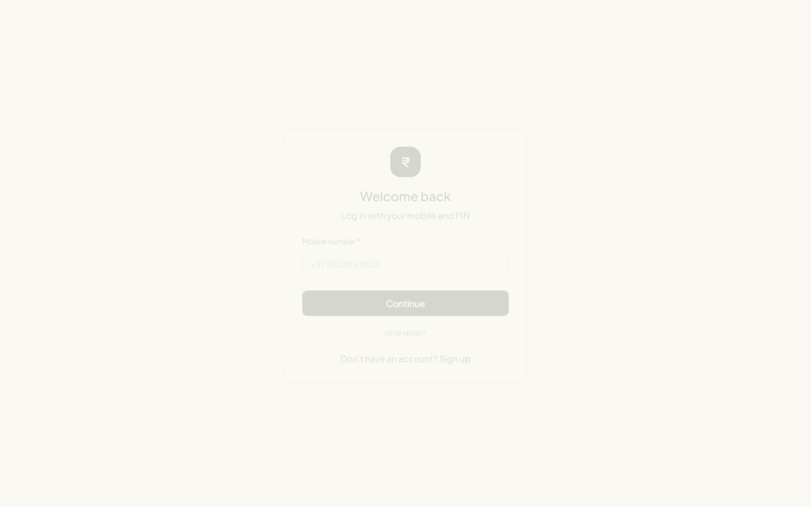
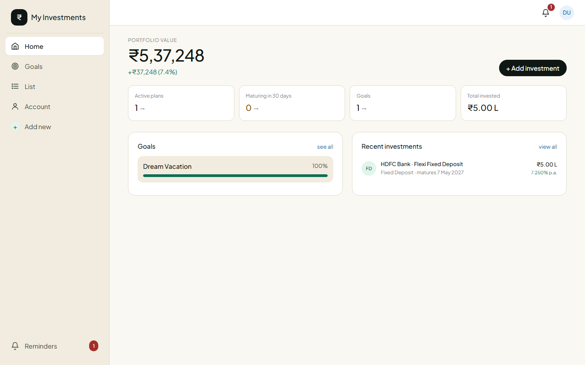
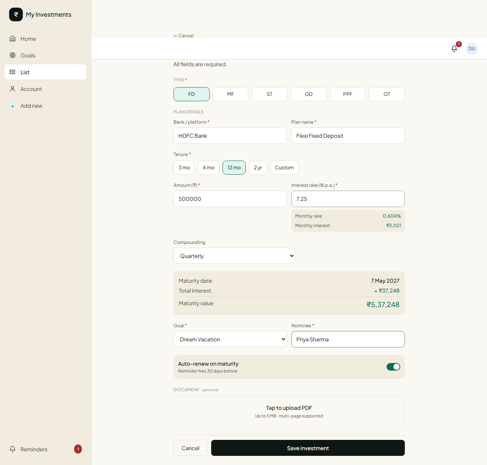
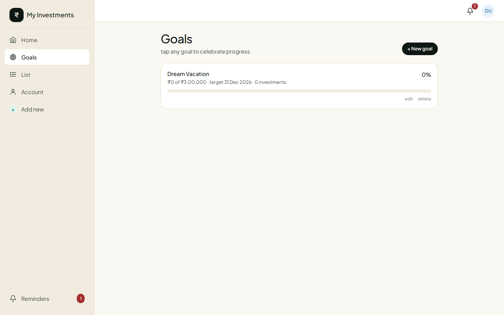
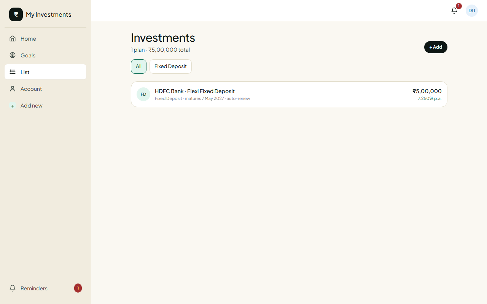
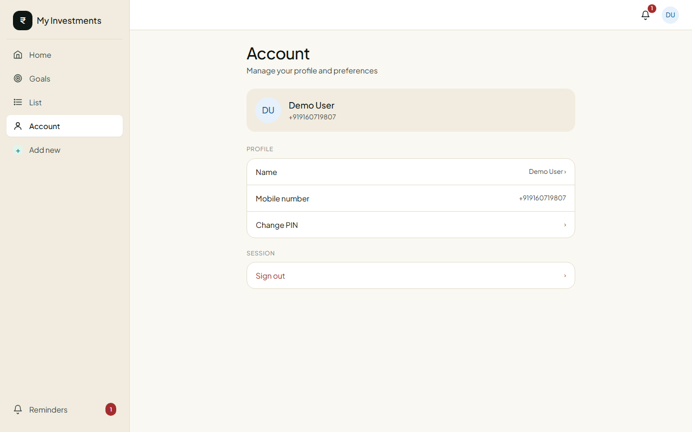

# My Investments

A free, always-on investment tracker. Built with Next.js + Neon Postgres.

Track FDs, mutual funds, stocks, gold, PPF, or any custom investment type.
Set goals, attach PDF documents, get reminders.

---

## Screenshots

| Login | Dashboard | Add investment |
|-------|-----------|----------------|
|  |  |  |

| Goals | Investments list | Account |
|-------|-----------------|---------|
|  |  |  |

---

## Getting started

### 1. Install

```bash
npm install
```

### 2. Set up the database

You already have a Neon project. Pick one (existing or a new one), then:

1. Open your Neon console at https://console.neon.tech
2. Go to **SQL Editor**
3. Paste the contents of `db/schema.sql` and run it
4. Go to **Connection Details** and copy the **pooled** connection string

### 3. Configure environment

Copy the example file and fill in your values:

```bash
cp .env.example .env.local
```

Edit `.env.local`:

```
DATABASE_URL=postgresql://...your-neon-pooled-url-with-sslmode=require
SESSION_SECRET=$(openssl rand -hex 32)
```

### 4. Run locally

```bash
npm run dev
```

Open http://localhost:3000

### 5. Deploy free on Vercel

```bash
npm i -g vercel
vercel
```

When prompted, paste the same `DATABASE_URL` and `SESSION_SECRET`.
Or set them in the Vercel dashboard under Project Settings → Environment Variables.

That's it — your app is live at `your-project.vercel.app`, free forever.

---

## Fork it for yourself

1. **Fork** this repo on GitHub (top-right "Fork" button), then clone your fork:

   ```bash
   git clone https://github.com/YOUR_USERNAME/InvestmentTracker.git
   cd InvestmentTracker
   npm install
   ```

2. **Create a Neon database** at https://console.neon.tech (free tier is enough).
   Run `db/schema.sql` in the Neon SQL editor to create all tables.

3. **Create `.env.local`** from the example:

   ```bash
   cp .env.example .env.local
   ```

   Fill in `DATABASE_URL` (pooled connection string from Neon) and a random `SESSION_SECRET`:

   ```bash
   # generate a strong secret
   openssl rand -hex 32
   ```

4. **Run locally** to verify everything works:

   ```bash
   npm run dev     # http://localhost:3000
   ```

5. **Deploy** to Vercel for free — link your forked repo in the Vercel dashboard and add
   the two environment variables (`DATABASE_URL`, `SESSION_SECRET`) under Project Settings →
   Environment Variables.

### Optional customisations

| What | Where |
|------|-------|
| App name shown in the sidebar | `components/Shell.js` — change `"My Investments"` |
| Page `<title>` tag | `app/layout.js` — update `metadata.title` |
| Add a new investment type | `lib/format.js` → `TYPE_META`, then `app/investments/new/NewInvestmentClient.js` → `TYPES` array |
| Currency symbol | `lib/format.js` → `inr()` / `inrShort()` — swap `₹` for your symbol |
| Colour scheme | `tailwind.config.js` — the design uses mint/sky/ember/honey/plum palettes |

---

## Re-running screenshots

The script `scripts/take-screenshots.js` drives a real browser through the full app
flow and saves 16 PNGs to `screenshots/`. Run it whenever you make UI changes:

```bash
# one-time setup (skip if already done)
npm install -D playwright
npx playwright install chromium

# start the dev server in one terminal
npm run dev

# capture all screenshots in another terminal
node scripts/take-screenshots.js
```

The script creates a fresh demo user with a timestamp-based mobile number each run,
so there are no conflicts with existing data. Screenshots are saved to `screenshots/`
and the filenames are numbered in flow order.

---

## What's inside

```
app/
  api/                  → REST endpoints (auth, goals, investments, notifications)
  login/                → mobile + 6-digit PIN
  signup/               → name + mobile, set new PIN
  home/                 → dashboard with empty state, portfolio, goals, recent
  goals/                → list + new goal (name + amount required, date optional)
  investments/          → list, new (with all required fields), detail with PDF viewer
  notifications/        → reminders with mark-read and mark-all
  account/              → edit name, change PIN, sign out
components/
  Shell.js              → bottom nav (mobile) + sidebar (desktop), bell badge
  PinInput.js           → 6-digit PIN entry with auto-advance
lib/
  db.js                 → Neon client
  auth.js               → PIN hashing, sessions, mobile normalization
  format.js             → ₹ formatting, maturity calculator, type metadata
db/
  schema.sql            → Postgres tables (run once in Neon)
scripts/
  take-screenshots.js   → Playwright script that captures the full app flow
```

## Adding more investment types

Open `lib/format.js`, add a new entry to `TYPE_META`:

```js
RD: { label: 'Recurring Deposit', short: 'RD', tone: 'sky' },
```

Then in `app/investments/new/NewInvestmentClient.js` add `'RD'` to the `TYPES` array.
That's the only change. No schema migration needed because the database stores `type_code` as text.

## Free-tier notes

- Neon free tier: 0.5 GB storage, auto-suspends after inactivity but resumes in ~300ms
- Vercel free tier: unlimited static + 100 GB-hours serverless functions/month
- PDFs are stored as base64 in the database (5 MB cap per file). For higher volumes,
  switch the `data_url` field to point to Cloudflare R2 or Supabase Storage.
