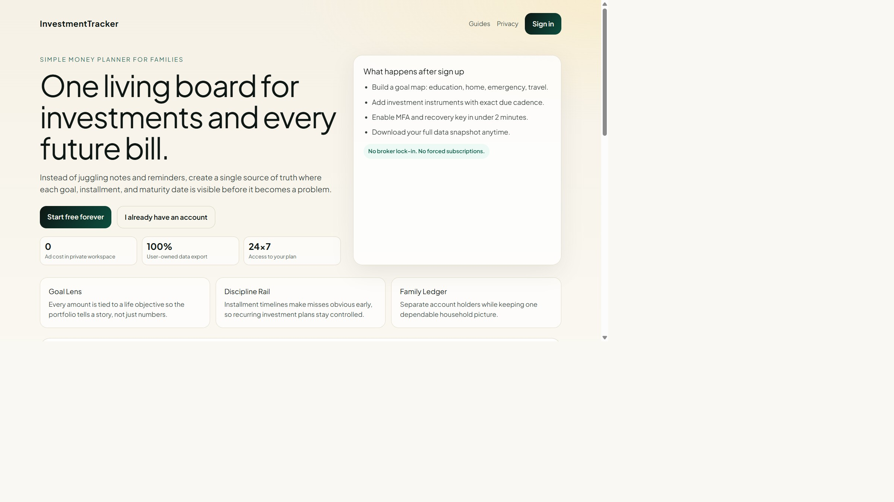

# My Investments

A free, always-on investment tracker. Built with Next.js + Neon Postgres.

Track FDs, mutual funds, stocks, gold, PPF, or any custom investment type.
Set goals, attach PDF documents, get reminders.

Public trust pages now live at `/`, `/privacy`, `/terms`, `/about`, `/resources`, and `/contact`.

---

## Main page preview



---

## Recent updates (June 2026)

### Password reset and recovery

- Fixed malformed reset-password form JSX and restored confirm-password validation behavior.
- Replaced browser `alert()` after backup-code copy with in-app toast feedback.
- Updated signup backup-codes screen:
  - removed the `Print codes` action
  - aligned `Copy codes` and `Continue to security setup` in one row
  - matched button styles
  - adjusted width and no-wrap behavior so labels stay clean
- Improved forgot-password network error copy:
  - shows a meaningful message when API is unreachable instead of generic `Failed to fetch`
- Improved backup-code API messaging:
  - `already used` returns a dedicated message
  - invalid/not-found code returns a clear backup-code-specific error

### MFA reliability and labeling

- Fixed MFA otpauth URI generation to prevent `InvestmentTracker: undefined` labels.
- Corrected `otplib` URI field usage (`label`), ensuring authenticator apps receive the intended account label.
- Sanitized account-label source values (`undefined`/`null`/empty handling) before MFA URI generation.
- Standardized current label behavior to use plain email where available.

### MFA UX and responsive modal improvements

- Added a structured in-app guide for deleting and recreating authenticator entries in:
  - Account MFA setup modal
  - Onboarding security MFA step
- Redesigned Account MFA setup modal layout:
  - app list and QR/manual code shown side-by-side on larger screens
  - stacked layout on smaller screens
  - viewport-safe max height with internal scroll for short displays
  - improved spacing and typography across mobile/tablet/laptop/desktop

### General UI consistency

- Added global toaster mounting in app layout for consistent in-app notification rendering.
- Sanitized account identifier display in account UI to avoid showing literal `undefined` / `null`.

---

## Screenshots

| Login | Dashboard | Add investment |
|-------|-----------|----------------|
|  |  |  |

| Goals | Investments list | Account |
|-------|-----------------|---------|
|  |  |  |

---

## Getting started

### 1. Install

```bash
npm install
```

### 2. Set up the database

You already have a Neon project. Pick one (existing or a new one), then:

1. Open your Neon console at https://console.neon.tech
2. Go to **SQL Editor**
3. Paste the contents of `db/schema.sql` and run it
4. Go to **Connection Details** and copy the **pooled** connection string

### 3. Configure environment

Copy the example file and fill in your values:

```bash
cp .env.example .env.local
```

Edit `.env.local`:

```
DATABASE_URL=postgresql://...your-neon-pooled-url-with-sslmode=require
SESSION_SECRET=your-64-char-random-hex
```

Generate `SESSION_SECRET` using any one method:

```bash
# OpenSSL
openssl rand -hex 32

# Node.js (works if Node is installed)
node -e "console.log(require('crypto').randomBytes(32).toString('hex'))"

# PowerShell (Windows, no OpenSSL needed)
powershell -Command "$b=New-Object byte[] 32; [System.Security.Cryptography.RNGCryptoServiceProvider]::Create().GetBytes($b); ($b|% { $_.ToString('x2') }) -join ''"
```

### 4. Run locally

```bash
npm run dev
```

Open http://localhost:3000

### 5. Deploy free on Vercel

```bash
npm i -g vercel
vercel
```

When prompted, paste the same `DATABASE_URL` and `SESSION_SECRET`.
Or set them in the Vercel dashboard under Project Settings → Environment Variables.

That's it — your app is live at `your-project.vercel.app`, free forever.

---

## Fork it for yourself

1. **Fork** this repo on GitHub (top-right "Fork" button), then clone your fork:

   ```bash
   git clone https://github.com/YOUR_USERNAME/InvestmentTracker.git
   cd InvestmentTracker
   npm install
   ```

2. **Create a Neon database** at https://console.neon.tech (free tier is enough).
   Run `db/schema.sql` in the Neon SQL editor to create all tables.

3. **Create `.env.local`** from the example:

   ```bash
   cp .env.example .env.local
   ```

   Fill in `DATABASE_URL` (pooled connection string from Neon) and a random `SESSION_SECRET`:

   ```bash
  # generate a strong secret (choose one)
  openssl rand -hex 32
  node -e "console.log(require('crypto').randomBytes(32).toString('hex'))"
  powershell -Command "$b=New-Object byte[] 32; [System.Security.Cryptography.RNGCryptoServiceProvider]::Create().GetBytes($b); ($b|% { $_.ToString('x2') }) -join ''"
   ```

4. **Run locally** to verify everything works:

   ```bash
   npm run dev     # http://localhost:3000
   ```

5. **Deploy** to Vercel for free — link your forked repo in the Vercel dashboard and add
   the two environment variables (`DATABASE_URL`, `SESSION_SECRET`) under Project Settings →
   Environment Variables.

### Optional customisations

| What | Where |
|------|-------|
| App name shown in the sidebar | `components/Shell.js` — change `"My Investments"` |
| Page `<title>` tag | `app/layout.js` — update `metadata.title` |
| Add a new investment type | `lib/format.js` → `TYPE_META`, then `app/investments/new/NewInvestmentClient.js` → `TYPES` array |
| Currency symbol | `lib/format.js` → `inr()` / `inrShort()` — swap `₹` for your symbol |
| Colour scheme | `tailwind.config.js` — the design uses mint/sky/ember/honey/plum palettes |

---

## Re-running screenshots

The script `scripts/take-screenshots.js` drives a real browser through the full app
flow and saves 16 app-flow PNGs to `screenshots/`. Run it whenever you make UI changes:

```bash
# one-time setup (skip if already done)
npm install -D playwright
npx playwright install chromium

# start the dev server in one terminal
npm run dev

# capture all screenshots in another terminal
node scripts/take-screenshots.js
```

To refresh the landing page screenshot used at the top of this README:

```bash
node -e "const { chromium } = require('playwright'); (async () => { const browser = await chromium.launch({ headless: true }); const page = await browser.newPage({ viewport: { width: 1440, height: 900 } }); await page.goto('http://localhost:3000/', { waitUntil: 'networkidle' }); await page.screenshot({ path: 'screenshots/00-landing-page.png', fullPage: true }); await browser.close(); })();"
```

The script creates a fresh demo user with a timestamp-based mobile number each run,
so there are no conflicts with existing data. Screenshots are saved to `screenshots/`
and the filenames are numbered in flow order.

---

## What's inside

```
app/
  api/                  → REST endpoints (auth, goals, investments, notifications)
  page.js               → public landing page (SEO + trust links)
  privacy/terms/about   → legal and trust pages
  resources/contact     → discoverability and support pages
  robots.js/sitemap.js  → crawl directives and index map
  login/                → email + password sign-in
  forgot-password/      → password reset request screen
  reset-password/       → password reset completion screen
  signup/               → name + email + strong password + legal acceptance
  home/                 → dashboard with empty state, portfolio, goals, recent
  goals/                → list + new goal (name + amount required, date optional)
  investments/          → list, new (with all required fields), detail with PDF viewer
  notifications/        → reminders with mark-read and mark-all
  account/              → edit name, change password, sign out
components/
  Shell.js              → bottom nav (mobile) + sidebar (desktop), bell badge
  PinInput.js           → legacy PIN entry component (kept for backward compatibility)
lib/
  db.js                 → Neon client
  auth.js               → password hashing/validation, sessions, email helpers
  security.js           → MFA/reset tokens + security event logging helpers
  format.js             → ₹ formatting, maturity calculator, type metadata
db/
  schema.sql            → Postgres tables (run once in Neon)
  migrations/           → incremental upgrade scripts for production databases
scripts/
  take-screenshots.js   → Playwright script that captures the full app flow
```

## Compliance and launch notes

- This app is a personal finance tracking tool, not financial advice.
- No special government approval is typically required for this scope alone, but legal review is required before adding regulated features (advisory, lending, brokerage, custody).
- If you collect personal data, keep Privacy Policy and Terms publicly accessible and linked from signup/login.
- Run migration `db/migrations/2026-06-28-add-legal-acceptance-to-users.sql` to store policy acceptance timestamp.
- Run migration `db/migrations/2026-06-28-auth-hardening-email-password.sql` before enabling new login/signup in production.
- Run migration `db/migrations/2026-06-28-add-mfa-reset-and-security-events.sql` before enabling MFA and password reset in production.
- If you already ran the auth-hardening migration before latest changes, run `db/migrations/2026-06-28-add-recovery-key-hash.sql` as a follow-up patch.
- Legacy login is removed; use Account -> Sync legacy mobile data for one-time migration from old mobile+PIN accounts.
- Password recovery uses internal recovery keys (no paid email/SMS integration required).

## SEO and AdSense readiness notes

- Public pages are indexable; authenticated routes are blocked in `robots.txt`.
- `sitemap.xml` includes only public pages.
- Ads should stay on public informational pages only; avoid ad placements inside authenticated financial workflows.
- Maintain original, useful content in `/resources` to improve AdSense approval chances.

## Adding more investment types

Open `lib/format.js`, add a new entry to `TYPE_META`:

```js
RD: { label: 'Recurring Deposit', short: 'RD', tone: 'sky' },
```

Then in `app/investments/new/NewInvestmentClient.js` add `'RD'` to the `TYPES` array.
That's the only change. No schema migration needed because the database stores `type_code` as text.

## Free-tier notes

- Neon free tier: 0.5 GB storage, auto-suspends after inactivity but resumes in ~300ms
- Vercel free tier: unlimited static + 100 GB-hours serverless functions/month
- PDFs are stored as base64 in the database (5 MB cap per file). For higher volumes,
  switch the `data_url` field to point to Cloudflare R2 or Supabase Storage.
